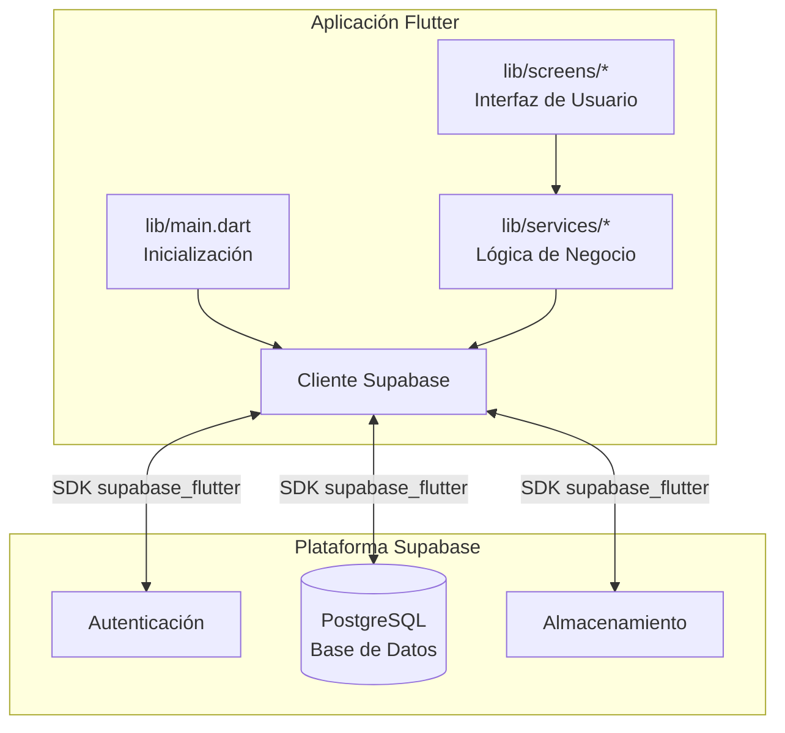

# Documentación Técnica - Proyecto Tienda

Este documento describe la arquitectura de carpetas y la estructura del proyecto desarrollado en Flutter. El proyecto utiliza Supabase como backend (indicado en las dependencias).

## Arquitectura de Carpetas Principal

La raíz del proyecto contiene varios archivos de configuración y carpetas específicas de plataforma, así como la carpeta principal `lib` donde reside el código fuente.

### Carpetas del Sistema y Plataformas
*   **`android/`, `ios/`, `macos/`, `linux/`, `windows/`, `web/`**: Contienen el código y las configuraciones específicas para cada plataforma en la que se puede compilar la aplicación. Generalmente no se modifican a menos que se requiera integración de código nativo o configuraciones específicas de compilación (ej. permisos, iconos de la app).
*   **`.dart_tool/`, `build/`**: Carpetas generadas automáticamente que contienen archivos de caché y el resultado de las compilaciones. No deben ser versionadas en Git ni modificadas manualmente.
*   **`.git/`**: Carpeta oculta que contiene el historial y la configuración del sistema de control de versiones Git.
*   **`.vscode/`**: Contiene configuraciones específicas del entorno de desarrollo Visual Studio Code (ej. configuraciones de depuración, snippets).

### Recursos y Documentación
*   **`assets/`**: Destinada a almacenar recursos estáticos de la aplicación, como imágenes (ej. `logo.png`), iconos, fuentes personalizadas y archivos de datos locales que se empaquetan con la aplicación.
*   **`docs/`**: Carpeta destinada a almacenar documentación adicional del proyecto.
*   **`resources/`**: Carpeta para recursos adicionales o scripts de apoyo al desarrollo.
*   **`test/`**: Contiene los archivos para realizar pruebas automatizadas (pruebas unitarias, de widgets y de integración) para asegurar el correcto funcionamiento del código.

### Código Fuente (`lib/`)
La carpeta `lib` es el corazón de la aplicación Flutter. Sigue una estructura modular básica para separar las diferentes responsabilidades.

*   **`lib/main.dart`**: Es el punto de entrada principal de la aplicación. Aquí se inicializa Flutter, se configuran servicios globales (como Supabase) y se define el widget raíz que inicia la navegación.
*   **`lib/screens/`**: Contiene todas las pantallas (vistas) que conforman la interfaz de usuario. Cada archivo suele representar una página completa a la que el usuario puede navegar:
    *   `login_page.dart` / `register_page.dart`: Pantallas para el flujo de autenticación.
    *   `home_page.dart`: Pantalla principal tras iniciar sesión.
    *   `profile_page.dart`: Pantalla para la gestión del perfil del usuario.
    *   `add_product_page.dart`: Pantalla para la adición de productos a la tienda.
    *   `purchases_page.dart`: Pantalla para visualizar las compras realizadas.
    *   `history_page.dart`: Pantalla para ver el historial general o de transacciones.
    *   `reward_details_page.dart`: Pantalla con los detalles de las recompensas o puntos de fidelidad.
*   **`lib/services/`**: Encapsula la lógica de negocio y la comunicación con servicios externos (Backend, APIs, Bases de datos locales).
    *   `auth_service.dart`: Archivo encargado de gestionar la lógica de autenticación de usuarios (registro, inicio de sesión, cierre de sesión), probablemente interactuando de forma directa con Supabase.
*   **`lib/theme/`**: Contiene la definición del diseño visual y la paleta de estilos de la aplicación.
    *   `prestige_theme.dart`: Archivo que define colores, tipografías, formas y otros aspectos visuales globales (el tema "Prestige"), permitiendo mantener una consistencia visual en todas las pantallas.

## Archivos de Configuración Relevantes
*   **`pubspec.yaml`**: Archivo fundamental donde se definen las dependencias externas (como `supabase_flutter`, `google_fonts`, `shared_preferences`), recursos estáticos (imágenes en `assets/`) y la versión de la aplicación.
*   **`pubspec.lock`**: Archivo generado automáticamente que bloquea las versiones exactas de las dependencias definidas en `pubspec.yaml` para asegurar compilaciones consistentes.
*   **`analysis_options.yaml`**: Archivo para configurar el linter de Dart. Define las reglas de análisis estático y buenas prácticas de código que el proyecto debe cumplir.
*   **`README.md`**: Archivo destinado a la descripción general del proyecto, instrucciones de instalación y uso básico para otros desarrolladores.

## Integración con Supabase (Base de Datos y Backend)

La aplicación utiliza **Supabase** como plataforma de Backend as a Service (BaaS) primaria, la cual proporciona la base de datos en tiempo real (PostgreSQL) y el sistema de autenticación.

### Diagrama de Conexión



### Inicialización y Conexión
La conexión a la base de datos se establece de forma global y única en el punto de entrada de la aplicación (`lib/main.dart`). Esto asegura que la instancia de Supabase esté lista antes de que se renderice cualquier pantalla:

```dart
await Supabase.initialize(
  url: 'https://jrwkxshvzbgcyosngzww.supabase.co',
  anonKey: '...', // Clave pública anónima de la API
);
```

Este proceso:
1. **Configura el Cliente**: Conecta la aplicación Flutter al proyecto específico alojado en Supabase utilizando la URL del proyecto y su clave pública (anonKey).
2. **Acceso Global**: Una vez ejecutado este método, el cliente queda instanciado y disponible en toda la aplicación bajo la llamada `Supabase.instance.client`. Esto significa que no se requiere crear múltiples conexiones; cualquier servicio o vista puede usar esta instancia compartida.

### Uso en la Aplicación
El consumo de esta conexión centralizada se concentra principalmente en los archivos dentro de la carpeta `lib/services/`. Por ejemplo, `auth_service.dart` utilizará el cliente de Supabase para manejar el registro de usuarios, el inicio de sesión y la gestión de sesiones directamente contra la base de datos y el sistema de autenticación de la plataforma. Las consultas (queries) a las tablas de la base de datos se realizan de manera asíncrona mediante el SDK proporcionado por `supabase_flutter`.
